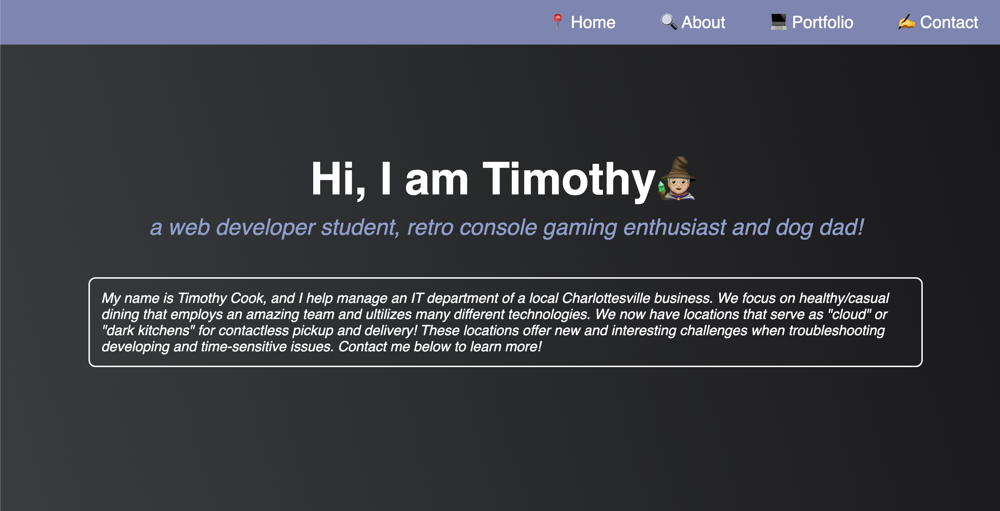
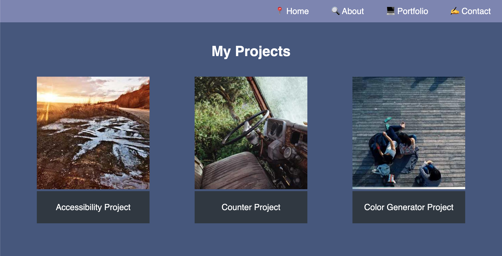

# Challenge1-Accessibility-Cook

Project Page: [Project Page](https://timothymichaelcook.github.io/challenge1-accessibility-cook/)

Project Repo: [Github-pages](https://github.com/timothymichaelcook/challenge1-accessibility-cook)

## Description

As a marketing agency, Horiseon wants a codebase to follow current accessibility standards which will result in Horiseon's webpage being optimized for search engines. Changes were made to the semeantic structure of the HTML and the styling of CSS selectors. Horiseon's webpage will also be better optimized for screen readers which will assist those with varying needs.

## User Story

```
- AS A marketing agency 
- I WANT to follow current accessibilty standards
- SO THAT I have an optimized webpape for search engines
```


## Installation

N/A

## Usage

Each section contains information on Horiseon. The header acts as a navbar, with Horiseon's logo in the top left corner of the screen and the navbar in the top right corner of the screen. The contents of the navbar include search engine optimization, online reputation management and socialmedia marketing which when clicked, moves the page to the corresponding link. The main contents of the page hold descriptions and images of the navbar links. The aside elements holds paragraph elements and images displaying the benefits Horiseon's services offer. The footer is the final section of the page, displaying webpage and company information.


## Credits

N/A

## License

MIT License

## Screenshots




## Contact
Timothy Cook - timothy.michael.cook@gmail.com


