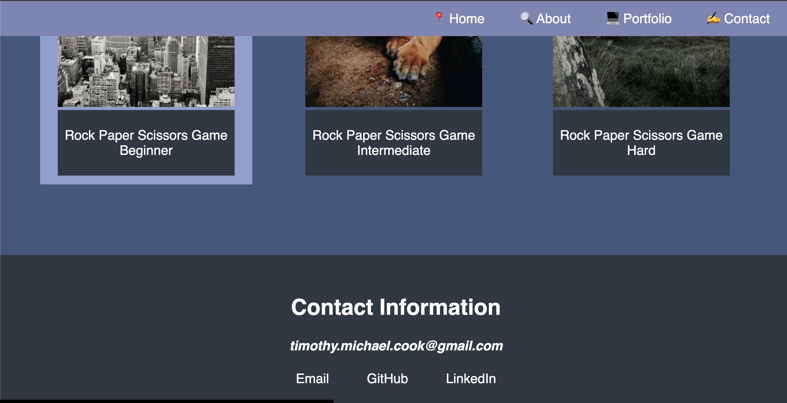

# Challenge2 Professional Portfolio Cook

Project Page: [Project Page](https://timothymichaelcook.github.io/challenge2-professional-portfolio-cook/)

Project Repo: [Github-pages](https://github.com/timothymichaelcook/challenge2-professional-portfolio-cook)

## Description

As a bootcamp student, I need a portfolio of work that can showcase my skills and talents to employers. This webpage is designed to display a porfolio which includes the following sections: a navbar with ID links scrolling to different parts of the webpages, an about section describing myself , portfolio section to view deployed applications and a contact section with links for email, GitHub and more. 

## User Story

```
- AS A bootcamp student 
- I WANT to have a portfolio webpage
- SO THAT I showcase my portfolio to employers
```

## Installation

N/A

## Usage

The navbar contains four links, home, about, projects and contact. These links will take you to the part of the page requested. Below is an about section containing a header element and p tags introducing myself and describing my background. Following is the portfolio section using grid display, with each project being an individual card. The final section is the contact section made up of a header element and a tags creating the different links. The page responds to different media sizes and can still be modified for additional features. 


## Credits

N/A

## License

MIT License

## Screenshots




## Contact
Timothy Cook - timothy.michael.cook@gmail.com


